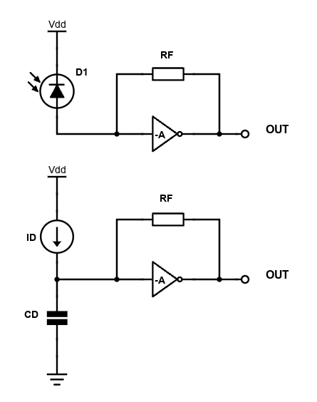
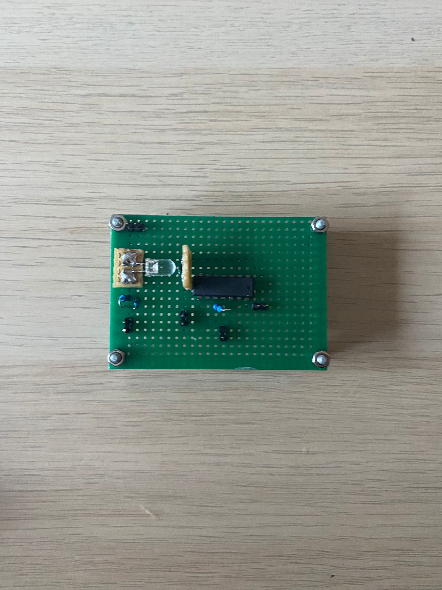
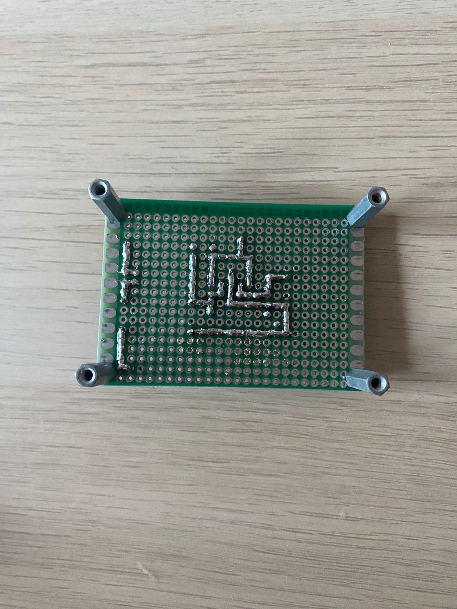
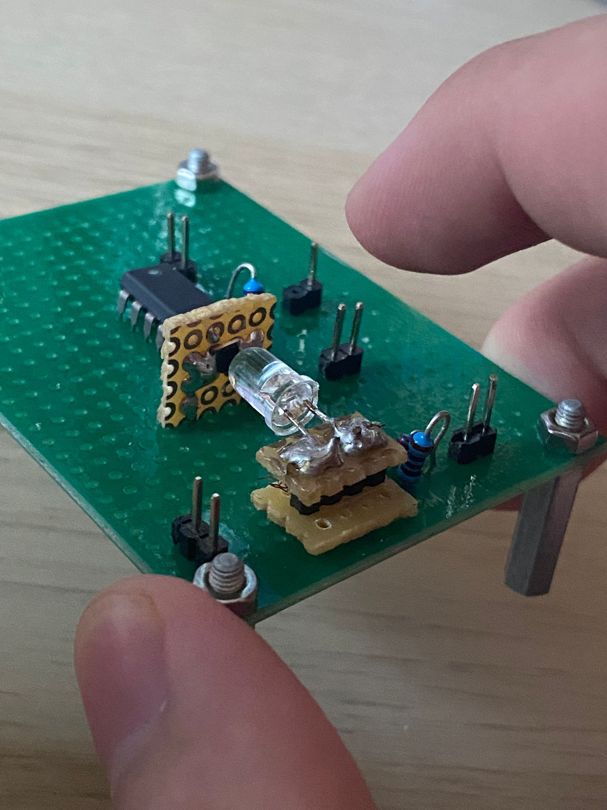
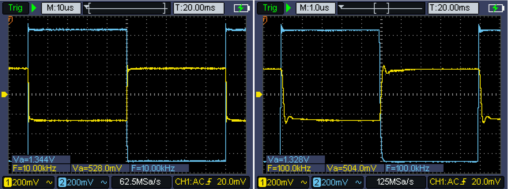

# CMOS Inverter as simple Transimpedance Amplifier
## Purpose
With this project, I aim to use a CD4007UBE CMOS inverter IC as the basis for a simple photodiode amplifier. CMOS inverters are usually used for digital applications and are as a result most often either driven into the linear or cutoff region, as staying too long in the saturation region will draw too much power.

However, the inverter can also be used as a low-gain amplifier in its saturation region. This often undocumented property of the CMOS inverter is utilized to our benefit in this project.

## Theory and design process

The easiest way of finding the open loop gain of the inverter (when in saturation) is to plot what is called the "Voltage Transfer Characteristic", or the VTC curve. The slope of the curve in the region of saturation (recoghizable because of the curve's steepness) is the open loop gain of the inverter, when no or minimal loading is present and no forms of negative feedback are introduced.

After some small-signal approximations, we may, as depicted in <a href="https://www.youtube.com/watch?v=TABgfsryt8s&ab_channel=TheSignalPath">this</a> "The Signal Path" video, obtain a closed loop gain $A_{CL}$ equal to $-\(gm_{n}+gm_{p}\)\cdot\(r_{o,n}||r_{o,p}||R_{F}\)$. $R_{F}$ is the value of the feedback resistor, introduced to stabilize the bias point of the inverter to about $\frac{1}{2}\\;V_{DD}$. The feedback resistor should have a high value, as loading the inverter too much might lower the gain significantly.

The video linked above does not go into detail about the capacitive loading of the circuit, as the various parasitic capacitances present in a CMOS inverter are very low, on the order of picoFarads. However, for photodiode amplifiers the diode capacitance of the photodetector has a clear impact on performance. The simplest TIA is a bare resistor connected in series with a reverse biased photodiode. The resistive TIA has severe bandwidth issues, as its Bandwidth (BW) is restricted to $f_{-3dB}=\frac{1}{2\\;\pi\cdot R_{L}\\;C_{D}}$. 

Active TIAs(either the slower op-amp based ones, or the faster GHz-level transistor ones), have the advantage of higher linearity and greater Bandwidth.

In this short project, the Transimpedance amplifier is centered around a CMOS inverter, as depicted in the figure presented below:

 
  

    
     
     
    <a><b>Inverter-based TIA and equivalent circuit for transfer function derivation</b></a>

 

We may develop a simple transfer function for our inverter-based TIA, in order to gauge the extent of the amplifier's bandwidth. After some mathematical manipulations we obtain an approximate transfer function of the form: 

$$\frac{V_{o}}{I_{in}}=\frac{R_{F}\cdot \frac{G}{1-G}}{1+s\cdot\frac{C_{in}\\;R_{F}}{1-G}}$$

We've represented the negative gain of the CMOS inverter as $G=-A$, where A is the gain of the **loaded** CMOS amplifier.

## Design process

I had at my disposal the following appropriate components:
- a 880nm Kodenshi IR emitter
- a Texas Instruments CD4007UBE (DIP14, unbuffered)
- a PD15-22B/TR8 940nm IR photodiode from Everlight

The Kodenshi emitter is modulated by the built-in function generator of my Owon oscilloscope. The biasing network of the IR led is a simple 220ohm resistor (quick and dirty). As a result of the simple circuit employed, we must ensure the control signal from the circuit is not negative (i.e. it has a DC offset), such that the IRLED does not act a rectifier and removes half of the signal.

The small PD15-22B photodiode has been soldered to a small piece of protoboard, connected via 2.5mm metal headers to the larger prototype board. The photodiode has a small capacitance, that is reduced to about half by the reverse bias applied to the photodetector. From my own past experiments I've observed that the maximum output current, when used in conjuction with the Kodenshi IRLED, is about 25 $\mu A$.

For the feedback resistor I used a 0.1% tolerance, 10 $K\Omega$ resistor, that I had from past projects.

Given a maximum diode current of 25 $\mu A$, the generated voltage would be 250mV, low enough not to break the biasing of the amplifier and high enough to be observable on the scope's screen.

The BW of our TIA should be large enough, on the order of several hundred KHz. However, my analysis only assumes the effect of the input/diode capacitance, the real circuit will have many more parasitic capacitances. Our 1st order approximation is not perfect, as we may observe ringing and a degree of instability when building the real circuit. 

## Showcase
The final implementation of the circuit looks like this:

 
  

    
     
     
    <a><b>TIA prototype from above</b></a>

 

 
  

    
     
     
    <a><b>TIA prototype from below, with solder traces visible</b></a>

 

 
  

    
     
     
    <a><b>Detail of the prototype board, IR emitter depicted</b></a>

 

In the figures shown below, we may observe the phase-inversion and slight ringing present in this circuit.

 
  

    
     
     
    <a><b>TIA performance for 10KHz and 100KHz, with deviations from the 1st order approximation present</b></a>

 

## Resources and Bibliography
-  https://www.nutsvolts.com/magazine/article/fet_principles_and_circuits_part_3
-  https://www.mdpi.com/2079-9268/9/3/26
-  https://www.youtube.com/watch?v=bhDK9I8kfNE&ab_channel=SanjeevniRastogi
-  https://www.youtube.com/watch?v=TABgfsryt8s&ab_channel=TheSignalPath\
-  https://ieeexplore.ieee.org/document/5547749
